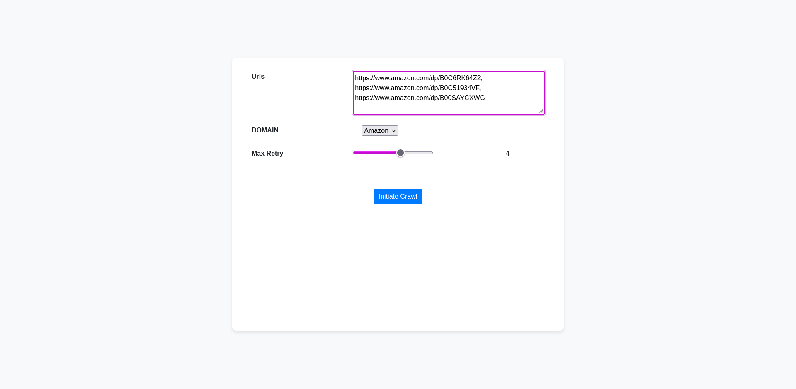

# Crawler and Data Extractor

[](https://www.python.org/)
[](https://redis.io/)
[](https://www.docker.com/)
[](https://developer.mozilla.org/en-US/docs/Web/JavaScript)


Simple Webcrawler written in python


## Overview

This is a Python-based project designed to crawl websites and extract relevant data from the input URLs provided. The extracted data can be further downloaded in-order to perform any sort of data analysis.

Since this was just a pet project, at present minimal data is extracted and the xpath coverage would be relatively low.




<!--  -->

## Features

- Serves data for multiple domains. The domain can be selected from the dropdown.
- Url Validation - Crawler alerts if any URL does not belong to selected domain.
- Customisable Retries - Users can define the number of retry attempts for each URL to receive a successful response.
- Save extracted data to various output formats, including CSV and Excel.
- Displays the URLs in queue in real-time.
- Notifies when a URL is retried or rejected.

## Usage

> **Note**
> Before proceeding, ensure that you have Docker installed on your system. If you don't have Docker installed, you can follow the instructions in the [Docker Installation Guide](https://docs.docker.com/get-docker/) to set it up.


1. Clone the project. 
```sh
git clone https://github.com/David-Vithayathil/web-crawler.git
```
2. Navigate to the root folder of the project.
```sh
cd web-crawler/
```
3. Run the command 
```sh
docker-compose build
docker-compose up -d
```
4. Once the docker-container is running. Simply navigate to the [home page](http://127.0.0.1:8000/api/v1/home)


## Contributing

Contributions to the project are welcome! If you encounter any issues or have suggestions for improvements, please feel free to open an issue or submit a pull request on the [GitHub repository](https://github.com/David-Vithayathil/web-crawler/issues).

It is suggested to use [pyenv](https://github.com/pyenv/pyenv) or any virtual env for development. The project is built on python 3.10.
The project uses [poetry](https://python-poetry.org/docs/) as dependency manager.

## Continuous Integration

- Linting : [black](https://pypi.org/project/black/) check

## Future Goals and Planned Features

- [x] Warn user about retried and rejected URLs.
- [ ] Display rejected URLs.
- [ ] Add button to clear all URL queue's.
- [ ] Provision to accept proxies. User provided proxies must be rotated.
- [ ] Improve error handling. Currently connection/network errors are not handled.
- [ ] Improve overall UI.
- [ ] Expand dataset and xpath's.


## License

This project is licensed under the MIT License.


## DISCLAIMER

Use of this service is limited only to non-sensitive and publicly available data. Respect robots.txt rules and be mindful of legal and ethical considerations when scraping data from websites.

